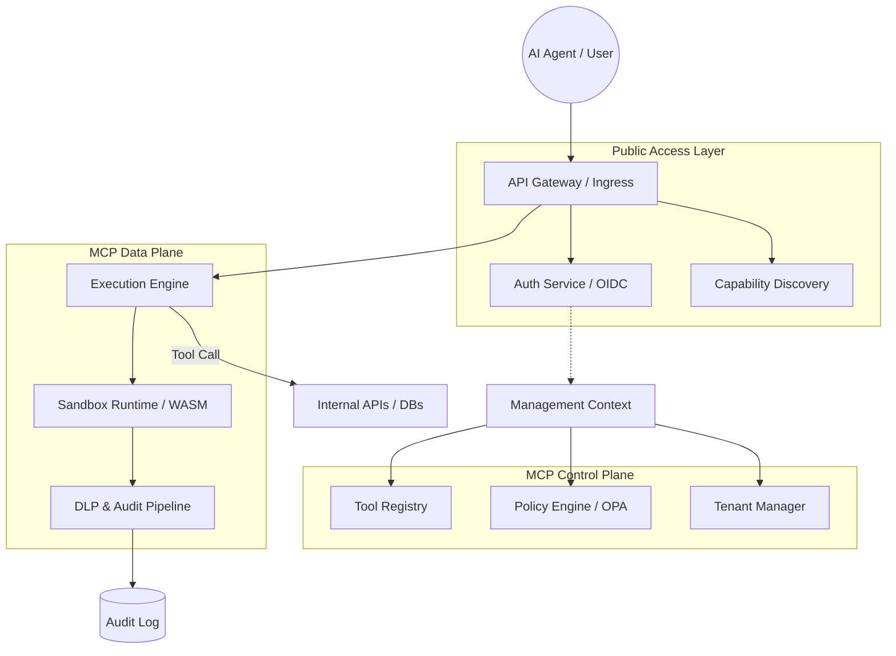
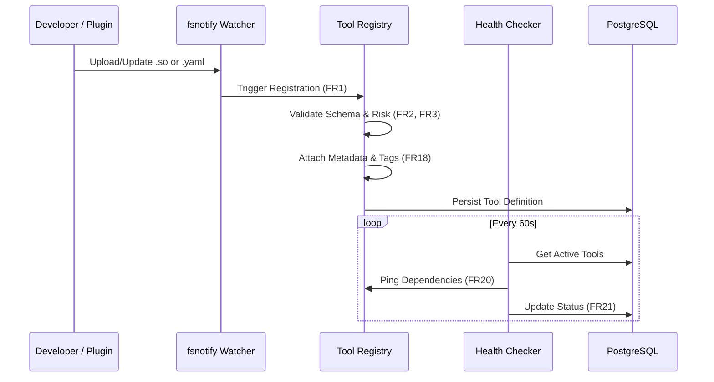
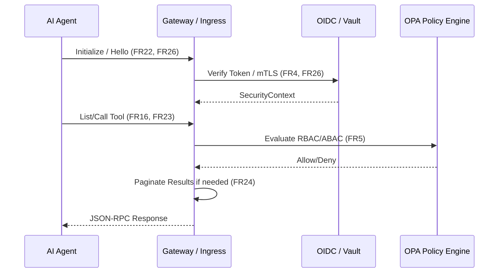
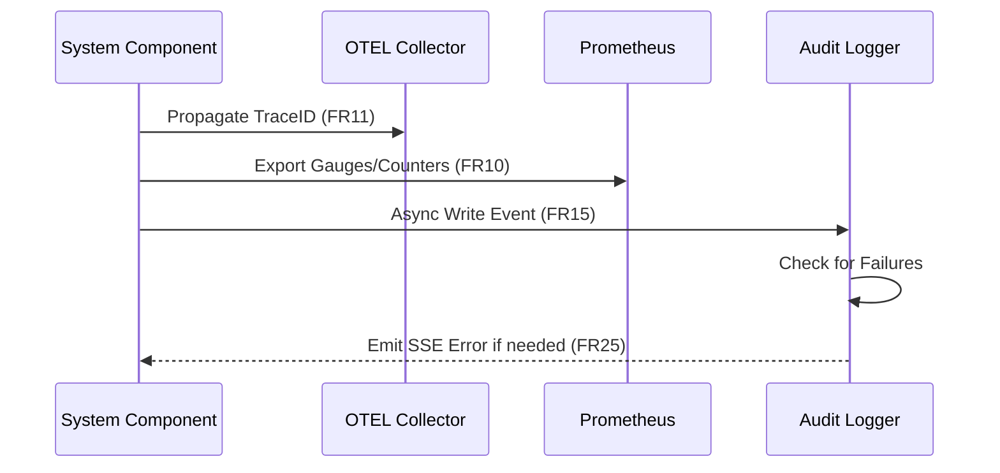

# Executive Architecture: MCP Platform

## 1. Executive Summary
The Model Context Protocol (MCP) platform is a secure, high-performance gateway designed to expose internal and third-party tools to AI models. It follows a **Zero-Trust AI Architecture** and enterprise-grade multi-tenancy to ensure strict data isolation and compliance.

## 2. System Component Diagram



## 3. Subsystem Breakdown

### 3.1 Public Access Layer
- **Ingress & Gateway**: Handles SSL (TLS 1.3) termination, rate limiting, and version-based request routing.
- **Identity Foundation**: Verifies actor credentials (AI Agent & End User) using OIDC/mTLS. Supports API Key and OAuth2 tokens.

### 3.2 MCP Control Plane
- **Governance Layer**: Manages the lifecycle of tools and tenants. Enforces company-wide security policies and metadata standards (FR18).
- **Policy Engine**: Asynchronous evaluation of RBAC/ABAC rules for every tool invocation. Includes a Prompt Injection Firewall (4.5).

### 3.3 MCP Data Plane
- **Isolation Layer**: Executes code in transient, hardened sandboxes (WASM). Enforces strict resource quotas (CPU/Memory).
- **Quality of Service (QoS)**: Implements circuit breakers, priority queues, and real-time resource metering (4.7) to maintain stability.
- **DLP Pipeline**: Real-time response filtering for PII (Social Security Numbers, Credit Cards, etc.).

## 4. Platform Technical Specification

| Category | Specification |
| :--- | :--- |
| **Language** | Golang (latest stable) |
| **Persistence** | PostgreSQL (Relational), Redis (Caching) |
| **Protocol** | MCP v1.x (Compliant), JSON-RPC 2.0 |
| **Transports** | HTTP/1.1, SSE (Streaming), WebSockets |
| **Throughput** | > 10,000 req/sec per node |
| **Latency** | < 20ms P99 gateway overhead |
| **Security** | Zero-Trust, mTLS, TLS 1.3, OIDC, OPA, WASM Sandbox |
| **Observability** | Prometheus (Metrics), OTEL (Tracing), Grafana |

## 5. Infrastructure Layout
- **Containerization**: Docker / Kubernetes.
- **Service Mesh**: Istio for mTLS and sidecar-based observability.
- **Deployment**: Multi-region regional worker clusters for low-latency tool execution near data sources.

## 6. Implementation Folder Structure

```text
mcp/
├── cmd/
│   └── mcp-server/           # Service entry points
├── configs/                  # External configuration files
├── internal/                 # Private application code
│   ├── adapters/             # External integrations (HTTP, Storage)
│   ├── config/               # Configuration loading logic
│   └── core/                 # Core domain and business logic (Hexagonal)
├── pkg/                      # Public shared libraries
├── plugins/                  # Dynamic tool plugins
├── scripts/                  # Build and automation scripts
├── specs/                    # Architecture and requirement documents
└── go.mod                    # Module definition
```

## 7. Data Flows by Functional Area

### 7.1 Tool Lifecycle (FR1-3, FR18-21)
This flow covers registration, discovery, and health monitoring.


### 7.2 Request & Security Gateway (FR4-5, FR16-17, FR22-24, FR26)
This flow handles the initial handshake and security validation.


### 7.3 Execution, Privacy & Metering (FR6-8, FR12-13)
This flow handles the actual tool run and data protection.
```mermaid
sequenceDiagram
    participant GW as Gateway
    participant Fire as Security Firewall
    participant Box as WASM Sandbox
    participant DLP as DLP Pipeline
    participant Meter as Metering Service
    
    GW->>Fire: Inspect Input (4.5)
    Fire->>Box: Allocate & Exec (FR6, FR7)
    Box->>Meter: Start Clock (4.7)
    Box->>Box: Execute with Secrets (FR8)
    Box->>DLP: Stream Output (FR12, FR13)
    DLP->>DLP: Mask PII in real-time
    DLP-->>GW: Redacted Stream
    GW->>Meter: End Clock & Record
```

### 7.4 Observability & Scaling Flow (FR9-11, FR14, FR15, FR25)


